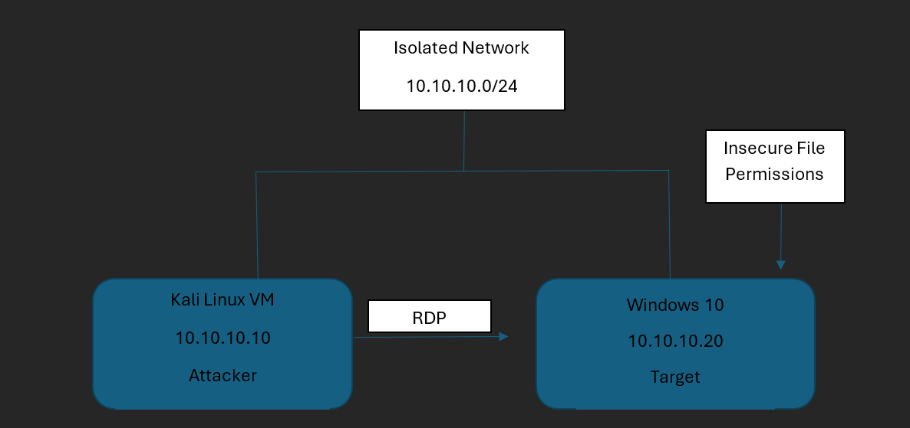

# windows-workstation-purple-team-lab
Hands-on Purple Team lab simulating Windows reconnaissance, attack, privilege escalation, detection, and remediation in an isolated environment.

# Windows Workstation Purple Team Attack & Detection Lab

A hands-on Purple Team lab simulating Windows reconnaissance, attack, privilege escalation, detection, and remediation in an isolated environment.

## Lab Architecture



* **Kali Linux** — Attacker
* **Windows 10** — Target
* **VirtualBox Host-Only Network**
* **Kali:** `10.10.10.10`
* **Windows:** `10.10.10.20`

## Tools

* Nmap
* SMBClient
* FreeRDP
* Wireshark
* Windows Event Viewer
* Windows Defender
* `sc`
* `icacls`

## Attack & Detection Workflow

```text
Reconnaissance
      ↓
SMB Authentication Testing
      ↓
RDP Initial Access
      ↓
Low-Privilege Foothold
      ↓
Privilege-Escalation Assessment
      ↓
Detection & Investigation
      ↓
Remediation
      ↓
Verification
```

## Key Findings

* Identified exposed Windows services through network reconnaissance.
* Detected controlled failed SMB authentication attempts.
* Established a low-privilege RDP session.
* Identified an insecure service configuration involving `LocalSystem` and writable file permissions.
* Remediated excessive file permissions.
* Verified that the low-privilege account could no longer modify the service payload.

> **Note:** SYSTEM-level execution was attempted but not successfully demonstrated due to limitations in the test service implementation.

## Evidence

Supporting screenshots are located in the [`evidence`](evidence/) directory.

## Report

The complete technical report is located in the [`lab-report`](Lab-Report/) directory.

## Disclaimer

This project was conducted in an isolated virtual environment for educational and portfolio purposes. All testing was performed on systems configured and authorized for the lab.
